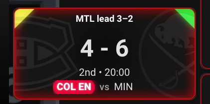
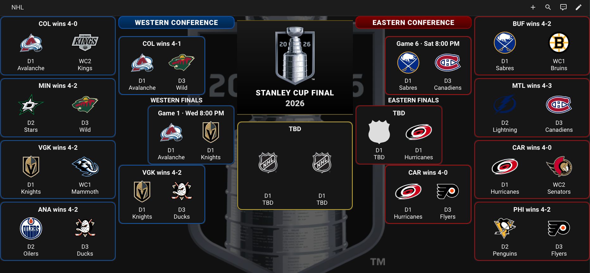

# 🏒 NHL Playoffs Dashboard  
Home Assistant custom integration and Lovelace dashboard for NHL Stanley Cup Playoff tracking — now fully rebuilt with live game overlays, new sensors, and a modern bracket layout.

---

> ## 🆕 What’s New in v2.3.0
> Major update released!  
> - New live game overlay (PP, EN, score, period, time remaining)  
> - New sensor naming format (`sensor.nhl_series_*`, `sensor.nhl_live_*`)  
> - New season banner + conference bars  
> - Dashboard fully rebuilt and optimized  
> - `layout-card` no longer required  
>
> 📌 **Important:** You must delete the old integration + old dashboard YAML before installing this update.  
>
> 👉 Full update notes: [`README-UPDATE.md`](README-UPDATE.md)

---

# 📦 Repository Contents

- `custom_components/nhl_playoffs/` — Home Assistant integration  
- `lovelace/nhl_playoffs_dashboard.yaml` — Updated Lovelace dashboard  
- `www/nhl/` — Local images folder (includes `tbd.png`)  
- `images/` — Screenshots for documentation  
- `hacs.json` — HACS metadata  

---

# ⚙️ Installation

## 🔧 Manual Install
1. Copy `custom_components/nhl_playoffs/` into:
   ```
   config/custom_components/
   ```
2. Restart Home Assistant.
3. Install required Lovelace custom card:
   - `button-card`  
4. Add the **NHL Playoffs** integration in Home Assistant.
5. Use the updated dashboard YAML in:
   ```
   lovelace/nhl_playoffs_dashboard.yaml
   ```

## 🧩 HACS Install
1. In HACS → Integrations → Custom Repositories  
2. Add:
   ```
   https://github.com/astlgit/nhl_playoffs_ha_dashboard
   ```
3. Install **NHL Playoffs Dashboard**  
4. Install `button-card` (layout-card no longer required)  
5. Restart Home Assistant  

---

# 🖼️ Screenshots

### Live Game — Power Play Active  

### Live Game — Empty Net + Score + Period + Time Remaining  


### Partial Season View (2026) (UPDATED) 


### Integration Setup  


### Full Season View (2024)  


---

# 🧩 Integration Setup

After installation:

1. Go to **Settings → Devices & Services → Integrations**  
2. Add **NHL Playoffs**  
3. Select your season (auto or manual)  
4. Integration creates:
   - Series sensors  
   - Live game sensors  
   - Season metadata  

---

# 📡 Sensor Naming (Updated)

## Series Sensors  
```
sensor.nhl_series_r1_east_1
sensor.nhl_series_r1_west_1
sensor.nhl_series_r2_east_1
sensor.nhl_series_r2_west_1
sensor.nhl_series_r3_east
sensor.nhl_series_r3_west
sensor.nhl_series_r4_final
```

## Live Game Sensors  
```
sensor.nhl_live_r1_east_1
sensor.nhl_live_r1_west_1
sensor.nhl_live_r2_east_1
sensor.nhl_live_r2_west_1
sensor.nhl_live_r3_east
sensor.nhl_live_r3_west
sensor.nhl_live_r4_final
```

## Live Attributes  
- `home_team`, `away_team`  
- `home_score`, `away_score`  
- `live_period`  
- `live_time_remaining`  
- `live_intermission`  
- `live_pp_team`  
- `live_empty_net_team`  
- `game_state`  

---

# 🖥️ Dashboard Installation

## Prerequisites
Before adding the dashboard, ensure:
- `button-card` is installed  
- `config/www/nhl/tbd.png` exists  
- The NHL Playoffs integration is configured  

## Method 1: YAML Mode (Legacy)
If using YAML mode:

1. Enable YAML mode:
   ```yaml
   lovelace:
     mode: yaml
   ```
2. Add the dashboard YAML to your Lovelace config.
3. Remove `panel: true` if adding to an existing view.
4. Restart Home Assistant.

## Method 2: UI Dashboard Editor (Recommended)
1. Create a new dashboard in **Settings → Dashboards**  
2. Open **Raw Configuration Editor**  
3. Paste the contents of:
   ```
   lovelace/nhl_playoffs_dashboard.yaml
   ```
4. Save and exit.

---

# 🧱 Dashboard Layout (Updated)

The dashboard uses a **5‑column bracket layout**:

- Columns 1–2 → Western Conference  
- Column 3 → Conference Finals  
- Columns 4–5 → Eastern Conference  

At the top:
- ~~Season banner~~  
- Western Conference bar  
- Eastern Conference bar  

Each series card includes:
- Team logos  
- Team names  
- Series wins  
- Game list  
- **Live game overlay**  

---

# 🛠 Development Notes

### Mapping  
`mapping_bracket.py` maps:
- Series letters A–O  
- Rounds  
- Conferences  
- Finals  

### Coordinators  
- `series_coordinator.py` → static series data  
- `live_coordinator.py` → real‑time game updates  

### Assets  
Team logos + banners pulled from NHL CDN.

---

# 🚧 Future Improvements

### Planned Features
- Dynamic Finals banner  
- Conference shield logos  
- Compact layout option  
- Game Center modal  
- Multi‑season selector  
- Automatic dark/light mode  

---

# 📜 License  
MIT License — see full text below.

This project is licensed under the **MIT License**. See the terms below:

Permission is hereby granted, free of charge, to any person obtaining a copy of this software and associated documentation files (the "Software"), to deal in the Software without restriction, including without limitation the rights to use, copy, modify, merge, publish, distribute, sublicense, and/or sell copies of the Software, and to permit persons to whom the Software is furnished to do so, subject to the following conditions:

The above copyright notice and this permission notice shall be included in all copies or substantial portions of the Software.

THE SOFTWARE IS PROVIDED "AS IS", WITHOUT WARRANTY OF ANY KIND, EXPRESS OR IMPLIED, INCLUDING BUT NOT LIMITED TO THE WARRANTIES OF MERCHANTABILITY, FITNESS FOR A PARTICULAR PURPOSE AND NONINFRINGEMENT. IN NO EVENT SHALL THE AUTHORS OR COPYRIGHT HOLDERS BE LIABLE FOR ANY CLAIM, DAMAGES OR OTHER LIABILITY, WHETHER IN AN ACTION OF CONTRACT, TORT OR OTHERWISE, ARISING FROM, OUT OF OR IN CONNECTION WITH THE SOFTWARE OR THE USE OR OTHER DEALINGS IN THE SOFTWARE.

